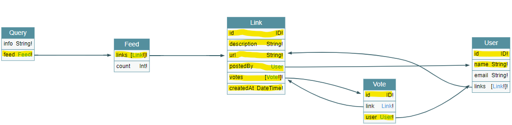

# GraphQL.js - Prisma.io

Full stack demo using [Prisma.io](https://www.prisma.io/). Focusing on debugging end-to-end GraphQL to SQL statements.

## Overview

This solution consists of two components.

- `hackernews-code` is based on [hackernews-graphql-js](https://github.com/howtographql/graphql-js) repository and it serves as the backend enabled GraphQL Server and Prisma Client.

- `hackernews-react-apollo` is based on [react-apollo](https://github.com/howtographql/react-apollo) repository and it is the frontend client that will consume the `hackernews-code` exposed GraphQL services.

## Enable debugging

The main goal of this demo is to showcase the how GraphQL.js queries are translated into Prisma queries and in turn to SQL queries.

### Tracing GraphQL request queries

In `hackernews-code/src/index.js` we are capturing the request from the context, discarding the `IntrospectionQuery` events for clarity and logging the query and variables into the console.

```javascript
const server = new ApolloServer({
    ...
    context: ({ req }) => {
        if (req.body.query.indexOf('IntrospectionQuery') < 0) {
            console.log('\x1b[36m%s\x1b[0m', 'graphQL:query', req.body.query);
            console.log('\x1b[36m%s\x1b[0m', 'graphQL:variables', req.body.variables);
        }
     ...
})
```

### Tracing Prisma Client requests

We enable set the environment variable `DEBUG` to enable debugging.

```bash
export DEBUG="prisma:client"
```

### Tracing SQL queries

In `hackernews-code/src/index.js` we enable query level log as an option in the Prisma Client instancing.

```javascript
const prisma = new PrismaClient({
    log: ['query'],
});
```

## TODO: run the demo

## Trace a search request

> **Note:** tracing is enabled in the `hackernews-code` component. 

1. First we navigate to [http://localhost:3000/search](http://localhost:3000/search) and enter a search term. We are going to search for `awesome graphql`.

The following request is received that uses the `FeedSearchQuery` method to return a query type.

```bash
graphQL:query query FeedSearchQuery($filter: String!) {
  feed(filter: $filter) {
    links {
      id
      url
      description
      createdAt
      postedBy {
        id
        name
        __typename
      }
      votes {
        id
        user {
          id
          __typename
        }
        __typename
      }
      __typename
    }
    __typename
  }
}

graphQL:variables { filter: 'awesome graphql' }
```

Here is a visual representation of the `hackernews-code/src/schema.graphql`, this file describes the GraphQL schema which defines the types and fields supported.



From the diagram we see that we are requesting a type `Query`, which in turn includes a type `Feed`, that defines an array of `Link` that relates to types `User` and `Vote`. Highlighted in yellow are the return fields and expansions expected in the response.

The type `Query` has a feed resolver defined on `hackernews-code/src/resolvers/Query.js` that calls the Prisma Client methods `findMany` and `count` on the class `link`. We see these first-level resolved calls next in the console output as Prisma Client generated requests.

> **Note: The `filter` variable has been replaced by the search term

```bash
prisma:client Generated request: +2ms
prisma:client query {
prisma:client   findManyLink(where: {
prisma:client     OR: [
prisma:client       {
prisma:client         description: {
prisma:client           contains: "awesome graphql"
prisma:client         }
prisma:client       },
prisma:client       {
prisma:client         url: {
prisma:client           contains: "awesome graphql"
prisma:client         }
prisma:client       }
prisma:client     ]
prisma:client   }) {
prisma:client     id
prisma:client     createdAt
prisma:client     description
prisma:client     url
prisma:client     postedById
prisma:client   }
prisma:client }
prisma:client  +0ms
```

Prisma Client generates the following SQL statement to retrieve the `Link` objects that matches the query. `filter` is replaced by the first positional parameter in the LIKE expression.

> **Note:** since no properties where specified on the `select` option to `findMany`, all properties are returned.

```bash
prisma:query SELECT `main`.`Link`.`id`, `main`.`Link`.`createdAt`, `main`.`Link`.`description`, `main`.`Link`.`url`, `main`.`Link`.`postedById` FROM `main`.`Link` WHERE (`main`.`Link`.`description` LIKE ? OR 
`main`.`Link`.`url` LIKE ?) LIMIT ? OFFSET ?
```

Similarly the `count` request is generated that translates to the following SQL statement

```bash
prisma:query SELECT COUNT(*) FROM (SELECT `main`.`Link`.`id` FROM `main`.`Link` WHERE (`main`.`Link`.`description` LIKE ? OR `main`.`Link`.`url` LIKE ?) LIMIT ? OFFSET ?) AS `sub`
```

Since at least one result was found Prisma Client proceeds to expand the `Link` object by using the `findUnique` method by `Link` and expanding `postedBy` and `votes`.

```javascript 
prisma:client Generated request: +2ms
prisma:client query {
prisma:client   findUniqueLink(where: {
prisma:client     id: 5
prisma:client   }) {
prisma:client     postedBy {
prisma:client       id
prisma:client       name
prisma:client       email
prisma:client       password
prisma:client     }
prisma:client   }
prisma:client }
prisma:client  +0ms
...
prisma:client Generated request: +1ms
prisma:client query {
prisma:client   findUniqueLink(where: {
prisma:client     id: 5
prisma:client   }) {
prisma:client     votes {
prisma:client       id
prisma:client       linkId
prisma:client       userId
prisma:client     }
prisma:client   }
prisma:client }
prisma:client  +0ms
```

Prisma Client generates the following SQL statement to retrieve the `User` object that posted the `Link`. Note that two statements are generated for this, the first one retrieves the `postedById` that identifies the `User` that posted the `Link` and next is the query to retrieve the `User` itself.

```bash
prisma:query SELECT `main`.`Link`.`id`, `main`.`Link`.`postedById` FROM `main`.`Link` WHERE `main`.`Link`.`id` = ? LIMIT ? OFFSET ?
prisma:query SELECT `main`.`User`.`id`, `main`.`User`.`name`, `main`.`User`.`email`, `main`.`User`.`password` FROM `main`.`User` WHERE `main`.`User`.`id` IN (?) LIMIT ? OFFSET ?
...
```

Since we are expanding the `votes` property on the type `Link`, and this one in particular has a vote. It proceeds the same way as before.

```bash
prisma:client Generated request: +1ms
prisma:client query {
prisma:client   findUniqueVote(where: {
prisma:client     id: 1
prisma:client   }) {
prisma:client     user {
prisma:client       id
prisma:client       name
prisma:client       email
prisma:client       password
prisma:client     }
prisma:client   }
prisma:client }
prisma:client  +1ms
```

Prisma Client generates the following SQL statement to retrieve the `User` object that posted the `Link`. Note that two statements are generated for this, the first one retrieves the `postedById` that identifies the `User` that posted the `Link` and next is the query to retrieve the `User` itself.

```bash
prisma:query SELECT `main`.`Vote`.`id`, `main`.`Vote`.`linkId`, `main`.`Vote`.`userId` FROM `main`.`Vote` WHERE `main`.`Vote`.`linkId` IN (?) LIMIT ? OFFSET ?
prisma:query SELECT `main`.`Vote`.`id`, `main`.`Vote`.`userId` FROM `main`.`Vote` WHERE `main`.`Vote`.`id` = ? LIMIT ? OFFSET ?
prisma:query SELECT `main`.`User`.`id`, `main`.`User`.`name`, `main`.`User`.`email`, `main`.`User`.`password` FROM `main`.`User` WHERE `main`.`User`.`id` IN (?) LIMIT ? OFFSET ?
```